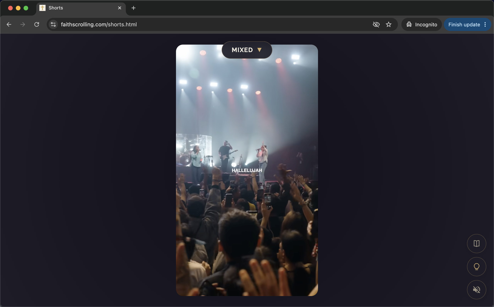

# Faith Scrolling Web App Code

The open source code for the FaithScrolling.com web app. Developers can use this code as a basis to build personalized vertical-scroll experiences that support multiple spoken languages and user interests.

Web App:<br>
https://faithscrolling.com/shorts.html

<br>


<p>Minimalist UI</p>

## What does the app do?

Instead of doomscrolling through stressful social media feeds, faithscrolling.com offers a healthy spiritual alternative. It uses the same vertical swipe mechanics as TikTok to give the user curated text and video content. The same scrolling habit and muscle memory is used for something positive. There are no ads, no signup and no tracking or other dark monetization patterns.

## Why I'm releasing the code

When I saw how smooth and fast the video playback worked I realized that there is an opportunity to disconnect the physical act of scrolling from the toxic social media algorithms. In other words, users can satisfy the habit without the harm.

This can be done by transitioning to curated scroll content. One way could be to give people the ability to create personalized short-video playlists, which they can then scroll through using browser-based video players. 

For example, a user could create a list of URLs of YouTube shorts. This list could be placed in a .txt file and uploaded to a shorts player. The videos can then be scrolled in the browser, without needing any expensive backend server infrastructure. This is how the Faith Scrolling video player works, except that the video URLs are hard coded.

## How to run the app

The code needs to be on a server for the video features to work. You can upload the code to a shared web server, like Dreamhost, or use a local desktop server.

This is how to use the python server on a Mac:

- Open the Terminal.
- Navigate to the folder containing the index.html file.
- Start the server by typing this in the terminal:<br>
```
  python3 -m http.server 8000
```
- Paste this into your web browser to launch the app:<br>
```
  http://localhost:8000/
```
- When you're done, go back to Terminal and press Ctrl+C to stop the server.

<br>

## Known issues
- When scrolling backwards, beyond video n-1, the audio is automatically disabled to prevent lagging. When the user re-engages the audio, playback continues smoothly. However, playback still lags when the user tries to re-enable audio when on the n-2 video. The other past videos (n-3, n-4, etc.) work without lagging.

<br>

## Revision History

Version 1.0<br>
6-July-2026<br>
First release.

<br>
